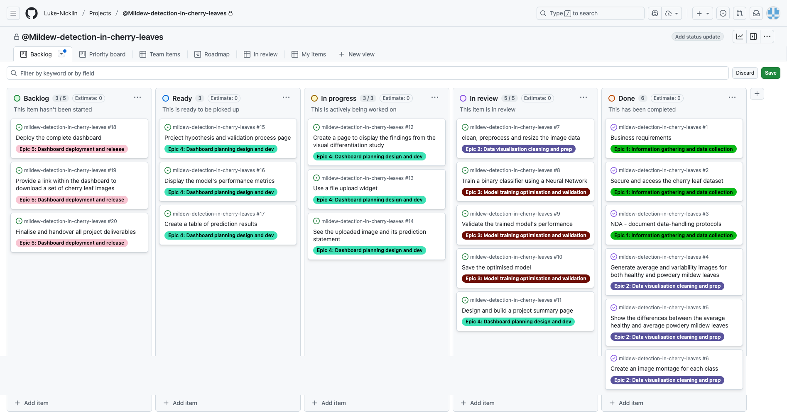

## Cherry Leaf Powdery Mildew Detector

# 

## Business Requirements

The cherry plantation crop from Farmy & Foods is facing a challenge where their cherry plantations have been presenting powdery mildew. Currently, the process is manual verification if a given cherry tree contains powdery mildew. An employee spends around 30 minutes in each tree, taking a few samples of tree leaves and verifying visually if the leaf tree is healthy or has powdery mildew. If there is powdery mildew, the employee applies a specific compound to kill the fungus. The time spent applying this compound is 1 minute. The company has thousands of cherry trees located on multiple farms across the country. As a result, this manual process is not scalable due to the time spent in the manual process inspection.

To save time in this process, the IT team suggested an ML system that detects instantly, using a leaf tree image, if it is healthy or has powdery mildew. A similar manual process is in place for other crops for detecting pests, and if this initiative is successful, there is a realistic chance to replicate this project for all other crops. The dataset is a collection of cherry leaf images provided by Farmy & Foods, taken from their crops.

- 1 - The client is interested in conducting a study to visually differentiate a healthy cherry leaf from one with powdery mildew.
- 2 - The client is interested in predicting if a cherry leaf is healthy or contains powdery mildew.

## Dataset Content

- The dataset is sourced from [Kaggle](https://www.kaggle.com/codeinstitute/cherry-leaves).
- The dataset contains 4208 images taken from the client's crop fields. The images show healthy cherry leaves and cherry leaves that have powdery mildew, a fungal disease that affects many plant species. The cherry plantation crop is one of the finest products in their portfolio, and the company is concerned about supplying the market with a compromised quality product.

## Hypotheses and validation

- **Hypothesis 1:** There is a noticeable visual difference between healthy cherry leaves and those infected with powdery mildew. This difference can be observed in features like texture, colour, and the presence of white, powdery spots.

- **Validation 1:** The hypothesis was tested using image montages, average images, variability images and by studying the differences.

- **Hypothesis 2:** A machine learning model can be trained to accurately classify cherry leaves as either healthy or infected, achieving an accuracy of 97% or higher.

- **Validation 2:** The hypothesis was tested by splitting the data into Training, Validation and Test sets, training the Convolutional Neural Network (CNN) on the training and validation sets and then using the test set to make predictions.

## The rationale to map the business requirements to the Data Visualisations and ML tasks

The project followed a CRISP-DM workflow in order to effectively map the business requirements with the machine learning tasks.

**Business requirement 1: Data visualisation**

The first requirement is a foundational step in any data sciencce project: exploratory data analysis (EDA). Before building a predictive model, it's crucial to understand the characteristics of the data. Analysing the average images, variability images, and creating an image montage for each class directly fulfills this need.

- Average and variability Images: These visualisations provide statistical insights into the dataset. The average images for healthy and powdery mildew leaves show the typical appearance of each class, showing the most common feature and colour patterns. In contrast, the variability images highlight areas of high pixel value variance, indicating where leaves are most diverse or where the disease manifests with different patterns. These visualisations help identify the key visual features that will likely be most useful for the model to learn.

- Image montage: A montage provides a qualitative overview of the dataset. It helps to visually inspect the variety of images, check for potential data quality issues (e.g., poor lighting or mislabelled images), and confirm that the dataset is representative of the real-world problem. This step validates the data's suitability for the project.

These tasks are essential for the data understanding phase of the CRISP-DM workflow, providing the necessary insights to inform the subsequent data preparation and modelling stages.

**Business requirement 2: Predictive ML system**

This requirement directly maps to a machine learning classification task. The goal is to build a system that can take an image as input and predict its class (healthy or powdery mildew). This is a classic binary image classification problem.

- Neural networks: Convolutional neural networks (CNN) is the industry-standard approach for image classification. CNNs are adept at learning hierarchical features from raw pixel data, making them ideal for this task. They can automatically identify complex patterns, such as the unique spots and textures associated with powdery midlew, without the need for manual feature engineering.

- Image resizing and model size: The recommendation to use a smaller image size (e.g., 50x50 or 100x100) is a practical constraint related to model deployment and management. A smaller input size leads to a smaller model with fewer parameters, which is easier to share, store on platfoms like GitHub, and deploy. This decision involves a trade-off: a smaller size might lead to a slight loss in detail, potentially impacting accuracy. The task, therefore, is about finding the optimal image size that meets the performance requirements while staying within the model size constraint. This strategic consideration is a key part of the data preparation and modeling phases, ensuring the final product is not only accurate but also practical for real-world use.

## ML Business Case

- An ML model is required to automate the diagnosis of cherry leaves as either healthy or infected with powdery mildew. This replaces the current slow and inaccurate manual inspection process.
- The model is a supervised, 2-class, single-label, classification task. Its primary goal is to provide a faster and more reliable detection method than a human-based method.
- A key success metric is achieving an accuracy of 97% or above on the test set, ensuring the model's reliability and building trust in its automated diagnostics. This was achieved with the selected model.
- The model's output provides actionable intelligence, specifically how it indicates infection and an associated probability score, which allows workers to make swift and informed decisions on the farm.

## Dashboard Design

Streamlit Multipage was used to create a menu with the following pages:

1. Summary - This page gives a high level overview of the project. It includes a description of what the powdery mildew fungal infection is, an image of a healthy cherry leaf, business requirements, key information and conclusions.

2. Project Hypotheses - This page includes details of the hypotheses described above, images of healthy and infected leaves and objectives for the project.

3. Leaves Visualiser - This page contains 3 checkboxes so the user can see the:
    - Difference between average and variability image
    - Differences between average infected leaves and average healthy leaves
    - Image montage

4. Powdery Mildew Detector - This page includes a link to download the cherry leaf data set, file upload functionality so a user can upload an image and a predict button so users can detect the presence of powedery mildew using the machine learning model. It will display the image, the prediction result and a barplot of the visual representation of the precidtion. There is also a download button where users can download the results as a csv file.

5. ML Performance - This page shows a bar chart of the labels distribution in train, validation and test sets, the model history for accuracy and loss, a table that showcases the genralised performance on the test set and information on the models accuracy.

## Unfixed Bugs

- There are currently no known bugs associated with this project.
- The only issue I encountered whilst building the predicitve analytics project is the fact I had to use Python version 3.12 instead of the latest Python version 3.13, as certain libraries/frameworks and packages weren't compatiable with the latest version of python. I therefore had to rework certain bits of code to make sure it worked with Python 3.12.

## Deployment

### Render

- The App live link is: `https://mildew-detection-in-cherry-leaves-h9jw.onrender.com/`
- The project was deployed to Render using the following steps.

1. Create a Web Service. Log in to your Render account and create a new "Web Service."
2. Connect to GitHub. Link your Render account to your GitHub repository and select the project you want to deploy.
3. Configure Settings. Name your service and confirm the correct branch is selected for deployment.
4. Add Build and Start Commands. Provide the build command pip install -r requirements.txt && ./setup.sh and the start command streamlit run app.py.
5. Create Service. Click the button to create your service and start the automatic deployment.
6. Access App. Once the build is complete, use the provided public URL to access your live application.

## Main Data Analysis and Machine Learning Libraries

- Here, you should list the libraries used in the project and provide an example(s) of how you used these libraries.

- Streamlit - Used to build to user interface and turn Python scripts into an interactive web app.
- Keras - A deep learning framework used to build and load the Convolutional Nerual Network (CNN) model. It also allows you to use a trained model for precition within the web app.
- Pillow (PIL) - Used to open, reseize and convert image files to the format required by the model.
- NumPy - Used to handel the image data.
- Plotly - Used to create the bar chart that displays the model's prediction probabilities, giving the user a clear understanding of the results.
- Pandas - Used to create a DataFrame that structures the prediction results, making it easy to display them and provide a download link.
- OS - Used to create robust file paths that work correctly on different systems, avoiding common errors like those caused by a backslash or forward slash.

## Testing - Python PEP-8

All python pages for this project have been tested using the [Code Institute Python Linter](https://pep8ci.herokuapp.com/).

- Leaves Visualiser page 
- Ml Performance page 
- Multipage 
- Powdery Mildew Detector page 
- Project Hypotheses page 
- Summary page 
- Evaluate CLF page 
- Predictive Analysis page 
- Data Management page 
- App page 

### Manual testing

**Summary page**

Test: Make sure users can see the summary page so they can read key information about the project.

Steps:

1. Navigate to [Mildew Detection In Cherry Leaves](https://mildew-detection-in-cherry-leaves-h9jw.onrender.com/)
2. Select 'Summary' radio

Expected:

The summary page appears when you select the 'Summary' radio button and shows the relevant content.

Actual:

The summary page appears when you select the 'Summary' radio button and it shows the relevant content.

**Project hypothesis**

Test: Make sure users can see the project hypotheses page so they can understand the hypotheses being tested.

Steps:

1. Navigate to [Mildew Detection In Cherry Leaves](https://mildew-detection-in-cherry-leaves-h9jw.onrender.com/)
2. Select 'Project Hypotheses' radio

Expected:

The project hypotheses page appears when you select the 'Project Hypotheses' radio button and shows the relevant content.

Actual:

The project hypotheses page appears when you select the 'project Hypotheses' radio button and it shows the relevant content.

**Leaves Visualiser**

Test: Make sure users can see the leaves visualiser page so they can see difference between average and variability image, differences between average infected leaves and average healthy leaves and image montage.

Steps:

1. Navigate to [Mildew Detection In Cherry Leaves](https://mildew-detection-in-cherry-leaves-h9jw.onrender.com/)
2. Select 'Leaves Visualiser' radio

Expected:

The leaves visualiser page appears when you select the 'Leaves Visualiser' radio button and shows the relevant content. The difference between average and variability image appears when you select the check box. The differences between average infected leaves and average healthy leaves image appears when you select the check box. The image montage appears when you select the check box and then select 'Create montage'. the image montage shows healthy leaves when you select 'healthy' in the drop down, and shows infected leaves when you select 'powdery_milkdew' in the drop down. The image montage is randomised and shows different images each time you select 'Create montage'.

Actual:

The leaves visualiser page appeared when I selected the 'Leaves Visualiser' radio button and showed the relevant content. The difference between average and variability image appeared when I selected the check box. The differences between average infected leaves and average healthy leaves image appeared when I selected the check box. The image montage appeared when I selected the check box and then selected 'Create montage'. The image montage showed healthy leaves when I selected 'healthy' in the drop down, and showed infected leaves when I selected 'powdery_milkdew' in the drop down. The image montage is randomised and showed different images each time I selected 'Create montage'.

## CRISP-DM

CRISP-DM (Cross-Industry Standard Process for Data Mining) is a widely used methodology for data minig projects. It provides a structured framework that organises data mining into 6 phases:

- Business understanding
- Data understanding
- Data preparation
- Modelling
- Evaluation
- Deployment

The project was planned using epics and user stories for each of the 6 CRISP-DM phases.

# 

## Credits

- The repository template used for this project was created by Code Institute.
- Code from Code Institute's Walk through Project 01 has been used on the Data collection, Data visualisation, Modelling Evaluating jupyter notebooks and app pages.
- Inspiration and code have been used and adapted from cla-cif's Cherry-Powdery-Mildew-Detector project [https://github.com/cla-cif/Cherry-Powdery-Mildew-Detector] and barty-s' cherry-leaf-mildew-detection project [https://github.com/barty-s/cherry-leaf-mildew-detection-project] for the Data collection, Data visualisation, Modelling Evaluating jupyter notebooks and app pages.
- Definition of cherry powdery mildew was adapted from the Washington State University website [https://treefruit.wsu.edu/crop-protection/disease-management/cherry-powdery-mildew/].
- The dataset was provided by Code Institute and can be found [here](https://www.kaggle.com/datasets/codeinstitute/cherry-leaves).
- In this section, you need to reference where you got your content, media and from where you got extra help. It is common practice to use code from other repositories and tutorials. However, it is necessary to be very specific about these sources to avoid plagiarism.
- You can break the credits section up into Content and Media, depending on what you have included in your project.

### Media

- The photo used on the app summary page and at the top of the read me file is a generic cherry leaf image taken from [Vecteezy](https://www.vecteezy.com/photo/53181854-close-up-of-a-vibrant-green-leaf).
